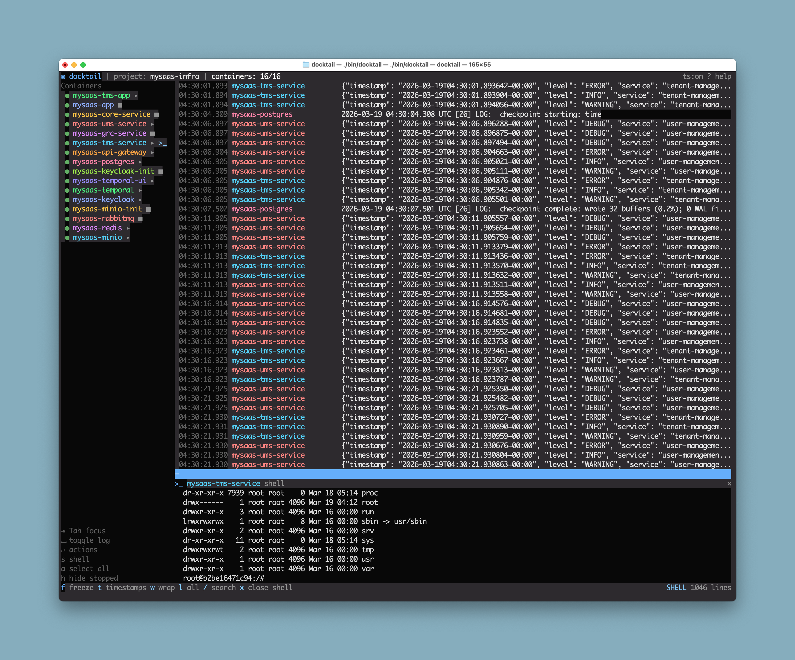

# docktail

A terminal UI for monitoring Docker and Kubernetes logs in real-time.


Docktail gives you a single-pane view of all container/pod logs across Docker Compose projects or Kubernetes namespaces, with search, filtering, navigation, clipboard support, and an integrated shell — all from your terminal.



## Features

**Log Streaming**
- Stream logs from all containers in a Docker Compose project or all pods in a Kubernetes namespace
- Color-coded container/pod names with auto-assigned palette
- Timestamps in `HH:MM:SS.mmm` format (local time), toggleable with `t`
- Per-container log stream lifecycle — streams auto-restart after container start/restart

**Navigation & Selection**
- Freeze logs with `f` to navigate, select, and copy
- Keyboard cursor navigation (`↑/↓`, `g/G`, `PgUp/PgDn`)
- Line selection with `Space`, range select with `Shift+↑/↓`
- Mouse support: click to freeze and move cursor, shift+click for range select, ctrl+click for multi-select, double-click to copy a line, scroll wheel
- Copy selected lines to clipboard with `y` (uses system clipboard with OSC52 fallback for remote terminals)

**Search & Filtering**
- Text and regex search with `/` (Tab toggles regex mode)
- Log level filtering: cycle through ALL/ERROR/WARN/INFO/DEBUG with `l`
- Search and filter apply to both existing and new incoming logs

**Container Management**
- Sidebar with container/pod list, status icons, and visibility toggles
- Container actions via `Enter` menu: start, stop, restart, pause, shell
- Toggle individual containers with `Space`, all with `a`
- Hide stopped/exited containers with `h`

**Integrated Shell**
- Open a shell into any running container or pod with `s` or from the action menu
- Raw PTY mode — full interactive shell with command history, tab completion
- Resizable shell panel with drag handle
- Auto-closes when the shell session ends

**Kubernetes Support**
- Monitor pod logs across any Kubernetes namespace
- Uses your kubeconfig — specify `--kube-context` and/or `--namespace`
- Shell into pods via the same `s` key or action menu
- Delete pods (restart) from the action menu — controllers will recreate them

**Theming**
- Light and dark themes with auto-detection based on terminal background
- Toggle between themes at runtime with `Shift+T`
- `--theme` flag: `dark`, `light`, or `auto` (default)

**Project Discovery**
- Auto-detects Docker Compose project from current directory
- Interactive project picker when multiple projects are running
- Fallback Docker socket detection for Docker Desktop, Colima, and OrbStack
- Kubernetes context and namespace resolution from kubeconfig

## Install

```bash
go install github.com/nilesh/docktail@latest
```

Or build from source:

```bash
git clone https://github.com/nilesh/docktail.git
cd docktail
make build
```

## Usage

### Docker (default)

```bash
# Auto-detect project from current directory
cd my-compose-project
docktail

# Specify project name
docktail --project myapp

# Monitor specific containers only
docktail --containers web,api,db

# Show logs from last hour
docktail --since 1h
```

### Kubernetes

```bash
# Monitor pods in a namespace (uses current kubeconfig context)
docktail -n my-namespace

# Specify a different kube context
docktail --kube-context staging -n my-namespace

# Monitor specific pods
docktail -n my-namespace --containers pod-abc,pod-xyz

# Show last 30 minutes of logs
docktail -n my-namespace --since 30m
```

### CLI Flags

| Flag | Description | Default |
|------|-------------|---------|
| `-p, --project` | Docker Compose project name | auto-detect |
| `-c, --containers` | Specific containers/pods to monitor | all |
| `-s, --since` | Show logs since timestamp (e.g., `1h`, `30m`) | — |
| `-t, --timestamps` | Show timestamps | true |
| `-w, --wrap` | Wrap long lines | false |
| `--theme` | Color theme: `dark`, `light`, `auto` | auto |
| `--no-color` | Disable colors | false |
| `--kube-context` | Kubernetes context name (enables K8s mode) | — |
| `-n, --namespace` | Kubernetes namespace (enables K8s mode) | from kubeconfig |

## Keyboard Shortcuts

### Global

| Key | Action |
|-----|--------|
| `f` | Freeze/unfreeze log stream |
| `t` | Toggle timestamps |
| `w` | Toggle line wrap (log panel only) |
| `l` | Cycle log level filter |
| `/` | Search (Tab toggles regex mode) |
| `T` | Toggle light/dark theme |
| `x` | Close shell panel |
| `Tab` | Cycle focus: sidebar / logs / shell |
| `?` | Help overlay |
| `q` | Quit |

### Sidebar (when focused)

| Key | Action |
|-----|--------|
| `↑/↓` or `j/k` | Navigate containers |
| `Space` | Toggle container log visibility |
| `Enter` | Open actions menu |
| `s` | Open shell for focused container |
| `a` | Select all / deselect all |
| `h` | Hide/show stopped containers |

### Logs (when frozen)

| Key | Action |
|-----|--------|
| `↑/↓` or `j/k` | Move cursor |
| `g` / `G` | Jump to top / bottom |
| `PgUp` / `PgDn` | Page up / down |
| `Space` | Toggle select current line |
| `Shift+↑/↓` | Range select |
| `y` or `c` | Copy selected lines to clipboard |
| `Esc` | Clear selection |

### Shell

| Key | Action |
|-----|--------|
| Type normally | Commands sent to container shell |
| `Esc` | Return focus to logs |

### Mouse

| Action | Effect |
|--------|--------|
| Click log line | Freeze and move cursor |
| Click and drag | Select a range of lines |
| Shift+click | Range select from cursor |
| Ctrl+click | Multi-select toggle |
| Double-click | Copy line to clipboard |
| Scroll wheel | Scroll logs (when frozen) |
| Click sidebar | Focus sidebar, toggle container |
| Right-click sidebar | Open action menu |
| Drag resize handle | Resize shell panel |

## Requirements

- Go 1.22+
- **Docker mode**: Docker daemon running (Docker Desktop, Colima, or OrbStack) with a Compose project
- **Kubernetes mode**: A valid kubeconfig with access to the target cluster

## License

MIT
